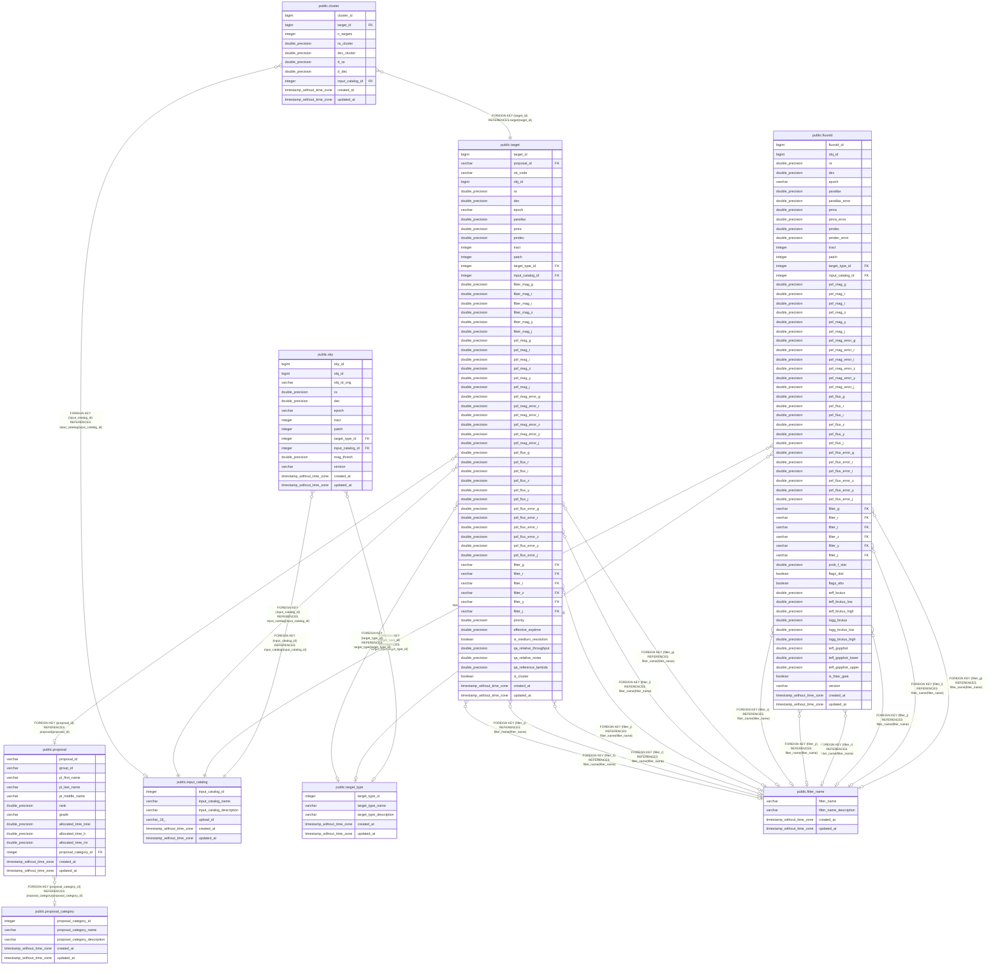

# PFS Target Database

## Tables

| Name | Columns | Comment | Type |
| ---- | ------- | ------- | ---- |
| [public.filter_name](public.filter_name.md) | 4 |  | BASE TABLE |
| [public.proposal_category](public.proposal_category.md) | 5 |  | BASE TABLE |
| [public.input_catalog](public.input_catalog.md) | 6 |  | BASE TABLE |
| [public.target_type](public.target_type.md) | 5 |  | BASE TABLE |
| [public.proposal](public.proposal.md) | 13 |  | BASE TABLE |
| [public.sky](public.sky.md) | 14 |  | BASE TABLE |
| [public.fluxstd](public.fluxstd.md) | 61 |  | BASE TABLE |
| [public.target](public.target.md) | 59 |  | BASE TABLE |
| [public.cluster](public.cluster.md) | 10 |  | BASE TABLE |

## Stored procedures and functions

| Name | ReturnType | Arguments | Type |
| ---- | ------- | ------- | ---- |
| public.q3c_seloper | bool | double precision, q3c_type | FUNCTION |
| public.q3c_sel | float8 | internal, oid, internal, integer | FUNCTION |
| public.q3c_seljoin | float8 | internal, oid, internal, smallint, internal | FUNCTION |
| public.q3c_version | cstring |  | FUNCTION |
| public.q3c_ang2ipix | int8 | double precision, double precision | FUNCTION |
| public.q3c_ang2ipix | int8 | ra real, decl real | FUNCTION |
| public.q3c_ipix2ang | _float8 | ipix bigint | FUNCTION |
| public.q3c_pixarea | float8 | ipix bigint, depth integer | FUNCTION |
| public.q3c_ipixcenter | int8 | ra double precision, decl double precision, integer | FUNCTION |
| public.q3c_dist | float8 | ra1 double precision, dec1 double precision, ra2 double precision, dec2 double precision | FUNCTION |
| public.q3c_sindist | float8 | double precision, double precision, double precision, double precision | FUNCTION |
| public.q3c_sindist_pm | float8 | ra1 double precision, dec1 double precision, pmra1 double precision, pmdec1 double precision, cosdec_flag integer, epoch1 double precision, ra2 double precision, dec2 double precision, epoch2 double precision | FUNCTION |
| public.q3c_dist_pm | float8 | ra1 double precision, dec1 double precision, pmra1 double precision, pmdec1 double precision, cosdec_flag integer, epoch1 double precision, ra2 double precision, dec2 double precision, epoch2 double precision | FUNCTION |
| public.q3c_nearby_it | int8 | double precision, double precision, double precision, integer | FUNCTION |
| public.q3c_nearby_pm_it | int8 | ra1 double precision, dec1 double precision, pmra1 double precision, pmdec1 double precision, cosdec_flag integer, maxepoch_delta double precision, rad double precision, flag integer | FUNCTION |
| public.q3c_ellipse_nearby_it | int8 | double precision, double precision, double precision, double precision, double precision, integer | FUNCTION |
| public.q3c_in_ellipse | bool | ra0 double precision, dec0 double precision, ra_ell double precision, dec_ell double precision, semimaj_ax double precision, axis_ratio double precision, pa double precision | FUNCTION |
| public.q3c_radial_query_it | int8 | double precision, double precision, double precision, integer, integer | FUNCTION |
| public.q3c_ellipse_query_it | int8 | ra_ell double precision, dec_ell double precision, semimajax double precision, axis_ratio double precision, pa double precision, iteration integer, full_flag integer | FUNCTION |
| public.q3c_poly_query_it | int8 | double precision[], integer, integer | FUNCTION |
| public.q3c_poly_query_it | int8 | polygon, integer, integer | FUNCTION |
| public.q3c_in_poly | bool | double precision, double precision, double precision[] | FUNCTION |
| public.q3c_in_poly | bool | double precision, double precision, polygon | FUNCTION |
| public.q3c_join | bool | leftra double precision, leftdec double precision, rightra double precision, rightdec double precision, radius double precision | FUNCTION |
| public.q3c_join | bool | leftra double precision, leftdec double precision, rightra real, rightdec real, radius double precision | FUNCTION |
| public.q3c_join_pm | bool | left_ra double precision, left_dec double precision, left_pmra double precision, left_pmdec double precision, cosdec_flag integer, left_epoch double precision, right_ra double precision, right_dec double precision, right_epoch double precision, max_epoch_delta double precision, radius double precision | FUNCTION |
| public.q3c_ellipse_join | bool | leftra double precision, leftdec double precision, rightra double precision, rightdec double precision, semimajoraxis double precision, axisratio double precision, pa double precision | FUNCTION |
| public.q3c_radial_query | bool | real, real, double precision, double precision, double precision | FUNCTION |
| public.q3c_radial_query | bool | double precision, double precision, double precision, double precision, double precision | FUNCTION |
| public.q3c_ellipse_query | bool | ra_col double precision, dec_col double precision, ra_ell double precision, dec_ell double precision, semimajax double precision, axis_ratio double precision, pa double precision | FUNCTION |
| public.q3c_poly_query | bool | double precision, double precision, double precision[] | FUNCTION |
| public.q3c_poly_query | bool | real, real, double precision[] | FUNCTION |
| public.q3c_poly_query | bool | double precision, double precision, polygon | FUNCTION |
| public.q3c_poly_query | bool | real, real, polygon | FUNCTION |

## Relations

---

> Generated by [tbls](https://github.com/k1LoW/tbls)
