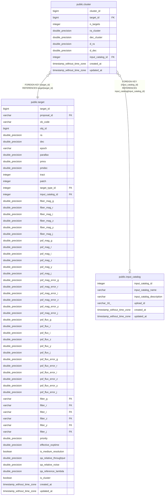

# public.cluster

## Description

## Columns

| Name | Type | Default | Nullable | Children | Parents | Comment |
| ---- | ---- | ------- | -------- | -------- | ------- | ------- |
| cluster_id | bigint |  | false |  |  | Unique identifier of clusters found at duplication checking |
| target_id | bigint |  | false |  | [public.target](public.target.md) |  |
| n_targets | integer |  | true |  |  | Number of targets in the cluster |
| ra_cluster | double precision |  | true |  |  | Mean RA of targets in the cluster (ICRS, degree) |
| dec_cluster | double precision |  | true |  |  | Mean Dec of targets in the cluster (ICRS, degree) |
| d_ra | double precision |  | true |  |  | RA(target) - RA(cluster) (degree) |
| d_dec | double precision |  | true |  |  | Dec(target) - Dec(cluster) (degree) |
| input_catalog_id | integer |  | true |  | [public.input_catalog](public.input_catalog.md) | Input catalog ID from the input_catalog table |
| created_at | timestamp without time zone |  | true |  |  | UTC |
| updated_at | timestamp without time zone |  | true |  |  | UTC |

## Constraints

| Name | Type | Definition |
| ---- | ---- | ---------- |
| cluster_input_catalog_id_fkey | FOREIGN KEY | FOREIGN KEY (input_catalog_id) REFERENCES input_catalog(input_catalog_id) |
| cluster_target_id_fkey | FOREIGN KEY | FOREIGN KEY (target_id) REFERENCES target(target_id) |
| cluster_pkey | PRIMARY KEY | PRIMARY KEY (cluster_id, target_id) |

## Indexes

| Name | Definition |
| ---- | ---------- |
| cluster_pkey | CREATE UNIQUE INDEX cluster_pkey ON public.cluster USING btree (cluster_id, target_id) |

## Relations

---

> Generated by [tbls](https://github.com/k1LoW/tbls)
