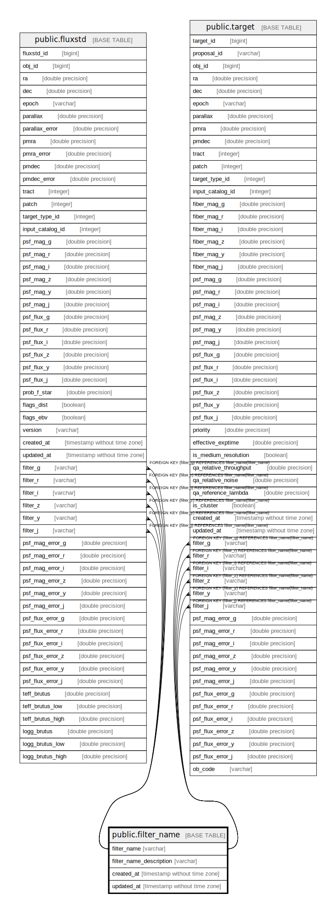

# public.filter_name

## Description

## Columns

| Name | Type | Default | Nullable | Children | Parents | Comment |
| ---- | ---- | ------- | -------- | -------- | ------- | ------- |
| filter_name | varchar |  | false | [public.fluxstd](public.fluxstd.md) [public.target](public.target.md) |  | Filter name (e.g., g_ps1) |
| filter_name_description | varchar |  | true |  |  | Description of the filter |
| created_at | timestamp without time zone |  | true |  |  | Creation time [YYYY-MM-DDThh:mm:ss] (UTC) |
| updated_at | timestamp without time zone |  | true |  |  | Update time [YYYY-MM-DDThh:mm:ss] (UTC) |

## Constraints

| Name | Type | Definition |
| ---- | ---- | ---------- |
| filter_name_pkey | PRIMARY KEY | PRIMARY KEY (filter_name) |
| filter_name_filter_name_key | UNIQUE | UNIQUE (filter_name) |

## Indexes

| Name | Definition |
| ---- | ---------- |
| filter_name_pkey | CREATE UNIQUE INDEX filter_name_pkey ON public.filter_name USING btree (filter_name) |
| filter_name_filter_name_key | CREATE UNIQUE INDEX filter_name_filter_name_key ON public.filter_name USING btree (filter_name) |

## Relations

---

> Generated by [tbls](https://github.com/k1LoW/tbls)
