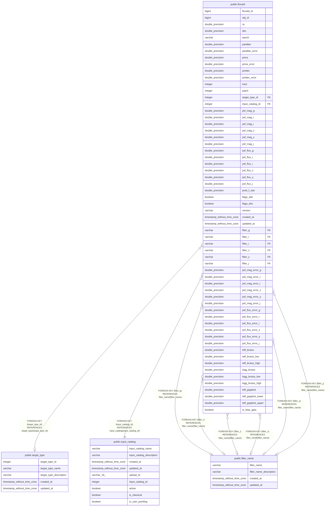

# public.fluxstd

## Description

## Columns

| Name | Type | Default | Nullable | Children | Parents | Comment |
| ---- | ---- | ------- | -------- | -------- | ------- | ------- |
| fluxstd_id | bigint | nextval('fluxstd_fluxstd_id_seq'::regclass) | false |  |  | Unique identifier for each flux standard star |
| obj_id | bigint |  | false |  |  | Gaia EDR3 sourceid |
| ra | double precision |  | false |  |  | RA (ICRS, degree) |
| dec | double precision |  | false |  |  | Dec (ICRS, degree) |
| epoch | varchar |  | true |  |  | Epoch (e.g., J2000.0, J2015.5, etc.) |
| parallax | double precision |  | true |  |  | Parallax (mas) |
| parallax_error | double precision |  | true |  |  | Standard error of parallax (mas) |
| pmra | double precision |  | true |  |  | Proper motion in right ascension direction (mas/yr) |
| pmra_error | double precision |  | true |  |  | Standard error of pmra (mas/yr) |
| pmdec | double precision |  | true |  |  | Proper motion in declination direction (mas/yr) |
| pmdec_error | double precision |  | true |  |  | Standard error of pmdec (mas/yr) |
| tract | integer |  | true |  |  | same definition as HSC-SSP?; can be derived from the coordinate |
| patch | integer |  | true |  |  | same definition as HSC-SSP?; can be derived from the coordinate; Note that it's defined as an integer |
| target_type_id | integer |  | true |  | [public.target_type](public.target_type.md) | target_type_id from the target_type table (must be 3 for FLUXSTD) |
| input_catalog_id | integer |  | false |  | [public.input_catalog](public.input_catalog.md) | input_catalog_id from the input_catalog table |
| psf_mag_g | double precision |  | true |  |  | g-band PSF magnitude (AB mag) |
| psf_mag_r | double precision |  | true |  |  | r-band PSF magnitude (AB mag) |
| psf_mag_i | double precision |  | true |  |  | i-band PSF magnitude (AB mag) |
| psf_mag_z | double precision |  | true |  |  | z-band PSF magnitude (AB mag) |
| psf_mag_y | double precision |  | true |  |  | y-band PSF magnitude (AB mag) |
| psf_mag_j | double precision |  | true |  |  | J band PSF magnitude (AB mag) |
| psf_flux_g | double precision |  | true |  |  | g-band PSF flux (nJy) |
| psf_flux_r | double precision |  | true |  |  | r-band PSF flux (nJy) |
| psf_flux_i | double precision |  | true |  |  | i-band PSF flux (nJy) |
| psf_flux_z | double precision |  | true |  |  | z-band PSF flux (nJy) |
| psf_flux_y | double precision |  | true |  |  | y-band PSF flux (nJy) |
| psf_flux_j | double precision |  | true |  |  | J band PSF flux (nJy) |
| prob_f_star | double precision |  | true |  |  | Probability of being an F-type star |
| flags_dist | boolean |  | true |  |  | Distance uncertanty flag, True if parallax_error/parallax \> 0.2 |
| flags_ebv | boolean |  | true |  |  | E(B-V) uncertainty flag, True if E(B-V) uncertainty is greater than 20% |
| version | varchar |  | false |  |  | Version string of the F-star selection |
| created_at | timestamp without time zone | timezone('utc'::text, CURRENT_TIMESTAMP) | true |  |  | The date and time in UTC when the record was created |
| updated_at | timestamp without time zone |  | true |  |  | The date and time in UTC when the record was last updated |
| filter_g | varchar |  | true |  | [public.filter_name](public.filter_name.md) | g-band filter (g_hsc, g_ps1, g_sdss, etc.) |
| filter_r | varchar |  | true |  | [public.filter_name](public.filter_name.md) | r-band filter (r_hsc, r_ps1, r_sdss, etc.) |
| filter_i | varchar |  | true |  | [public.filter_name](public.filter_name.md) | i-band filter (i_hsc, i_ps1, i_sdss, etc.) |
| filter_z | varchar |  | true |  | [public.filter_name](public.filter_name.md) | z-band filter (z_hsc, z_ps1, z_sdss, etc.) |
| filter_y | varchar |  | true |  | [public.filter_name](public.filter_name.md) | y-band filter (y_hsc, y_ps1, y_sdss, etc.) |
| filter_j | varchar |  | true |  | [public.filter_name](public.filter_name.md) | j-band filter (j_mko, etc.) |
| psf_mag_error_g | double precision |  | true |  |  | Error in g-band PSF magnitude (AB mag) |
| psf_mag_error_r | double precision |  | true |  |  | Error in r-band PSF magnitude (AB mag) |
| psf_mag_error_i | double precision |  | true |  |  | Error in i-band PSF magnitude (AB mag) |
| psf_mag_error_z | double precision |  | true |  |  | Error in z-band PSF magnitude (AB mag) |
| psf_mag_error_y | double precision |  | true |  |  | Error in y-band PSF magnitude (AB mag) |
| psf_mag_error_j | double precision |  | true |  |  | Error in J band PSF magnitude (AB mag) |
| psf_flux_error_g | double precision |  | true |  |  | Error in g-band PSF flux (nJy) |
| psf_flux_error_r | double precision |  | true |  |  | Error in r-band PSF flux (nJy) |
| psf_flux_error_i | double precision |  | true |  |  | Error in i-band PSF flux (nJy) |
| psf_flux_error_z | double precision |  | true |  |  | Error in z-band PSF flux (nJy) |
| psf_flux_error_y | double precision |  | true |  |  | Error in y-band PSF flux (nJy) |
| psf_flux_error_j | double precision |  | true |  |  | Error in J band PSF flux (nJy) |
| teff_brutus | double precision |  | true |  |  | Effective temperature from Brutus code [K] |
| teff_brutus_low | double precision |  | true |  |  | Lower confidence level (16%) of effective temperature from Brutus code [K] |
| teff_brutus_high | double precision |  | true |  |  | Upper confidence level (84%) of effective temperature from Brutus code [K] |
| logg_brutus | double precision |  | true |  |  | Surface gravity from Brutus code [log cgs] |
| logg_brutus_low | double precision |  | true |  |  | Lower confidence level (16%) of surface gravity from Brutus code [log cgs] |
| logg_brutus_high | double precision |  | true |  |  | Upper confidence level (84%) of surface gravity from Brutus code [log cgs] |
| teff_gspphot | double precision |  | true |  |  | Effective temperature inferred by GSP-phot Aeneas [K] |
| teff_gspphot_lower | double precision |  | true |  |  | Lower confidence level (16%) of effective temperature inferred by GSP-phot Aeneas [K] |
| teff_gspphot_upper | double precision |  | true |  |  | Upper confidence level (84%) of effective temperature inferred by GSP-phot Aeneas [K] |
| is_fstar_gaia | boolean |  | true |  |  | Flag for F-star from Gaia (Teff=6000-7500K if True) |

## Constraints

| Name | Type | Definition |
| ---- | ---- | ---------- |
| fluxstd_filter_g_fkey | FOREIGN KEY | FOREIGN KEY (filter_g) REFERENCES filter_name(filter_name) |
| fluxstd_filter_i_fkey | FOREIGN KEY | FOREIGN KEY (filter_i) REFERENCES filter_name(filter_name) |
| fluxstd_filter_j_fkey | FOREIGN KEY | FOREIGN KEY (filter_j) REFERENCES filter_name(filter_name) |
| fluxstd_filter_r_fkey | FOREIGN KEY | FOREIGN KEY (filter_r) REFERENCES filter_name(filter_name) |
| fluxstd_filter_y_fkey | FOREIGN KEY | FOREIGN KEY (filter_y) REFERENCES filter_name(filter_name) |
| fluxstd_filter_z_fkey | FOREIGN KEY | FOREIGN KEY (filter_z) REFERENCES filter_name(filter_name) |
| fluxstd_input_catalog_id_fkey | FOREIGN KEY | FOREIGN KEY (input_catalog_id) REFERENCES input_catalog(input_catalog_id) |
| fluxstd_target_type_id_fkey | FOREIGN KEY | FOREIGN KEY (target_type_id) REFERENCES target_type(target_type_id) |
| fluxstd_pkey | PRIMARY KEY | PRIMARY KEY (fluxstd_id) |
| uq_obj_id_input_catalog_id_version | UNIQUE | UNIQUE (obj_id, input_catalog_id, version) |

## Indexes

| Name | Definition |
| ---- | ---------- |
| fluxstd_pkey | CREATE UNIQUE INDEX fluxstd_pkey ON public.fluxstd USING btree (fluxstd_id) |
| uq_obj_id_input_catalog_id_version | CREATE UNIQUE INDEX uq_obj_id_input_catalog_id_version ON public.fluxstd USING btree (obj_id, input_catalog_id, version) |
| ix_fluxstd_version | CREATE INDEX ix_fluxstd_version ON public.fluxstd USING btree (version) |
| fluxstd_q3c_ang2ipix_idx | CREATE INDEX fluxstd_q3c_ang2ipix_idx ON public.fluxstd USING btree (q3c_ang2ipix(ra, "dec")) |
| ix_fluxstd_input_catalog_fluxstdid | CREATE INDEX ix_fluxstd_input_catalog_fluxstdid ON public.fluxstd USING btree (input_catalog_id, fluxstd_id) |
| ix_fluxstd_version_fluxstdid | CREATE INDEX ix_fluxstd_version_fluxstdid ON public.fluxstd USING btree (version, fluxstd_id) |

## Relations

---

> Generated by [tbls](https://github.com/k1LoW/tbls)
