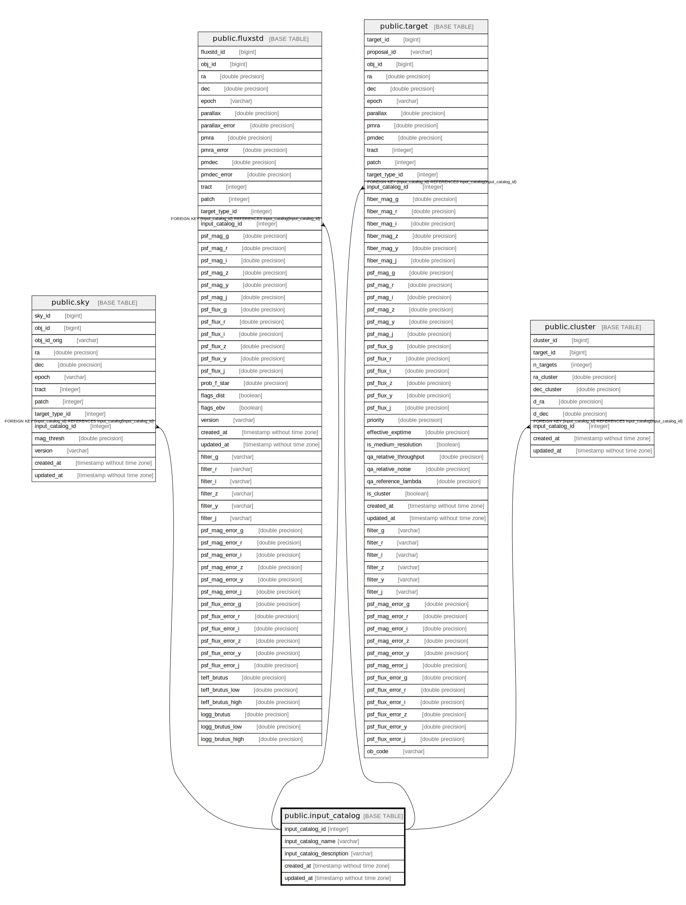

# public.input_catalog

## Description

## Columns

| Name | Type | Default | Nullable | Children | Parents | Comment |
| ---- | ---- | ------- | -------- | -------- | ------- | ------- |
| input_catalog_id | integer |  | false | [public.sky](public.sky.md) [public.fluxstd](public.fluxstd.md) [public.target](public.target.md) [public.cluster](public.cluster.md) |  | Unique identifier for input catalogs |
| input_catalog_name | varchar |  | true |  |  | Name of the input catalog (e.g., Gaia DR2, HSC-SSP PDR3, etc.) |
| input_catalog_description | varchar |  | true |  |  | Description of the input catalog |
| created_at | timestamp without time zone |  | true |  |  |  |
| updated_at | timestamp without time zone |  | true |  |  |  |

## Constraints

| Name | Type | Definition |
| ---- | ---- | ---------- |
| input_catalog_pkey | PRIMARY KEY | PRIMARY KEY (input_catalog_id) |
| input_catalog_input_catalog_name_key | UNIQUE | UNIQUE (input_catalog_name) |
| input_catalog_input_catalog_id_key | UNIQUE | UNIQUE (input_catalog_id) |

## Indexes

| Name | Definition |
| ---- | ---------- |
| input_catalog_pkey | CREATE UNIQUE INDEX input_catalog_pkey ON public.input_catalog USING btree (input_catalog_id) |
| input_catalog_input_catalog_name_key | CREATE UNIQUE INDEX input_catalog_input_catalog_name_key ON public.input_catalog USING btree (input_catalog_name) |
| input_catalog_input_catalog_id_key | CREATE UNIQUE INDEX input_catalog_input_catalog_id_key ON public.input_catalog USING btree (input_catalog_id) |

## Relations

---

> Generated by [tbls](https://github.com/k1LoW/tbls)
