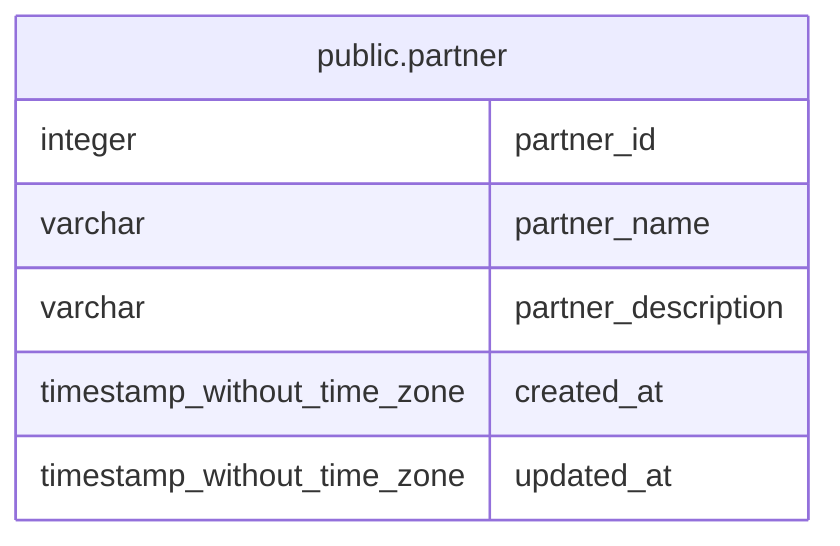

# public.partner

## Description

## Columns

| Name | Type | Default | Nullable | Children | Parents | Comment |
| ---- | ---- | ------- | -------- | -------- | ------- | ------- |
| partner_id | integer |  | false |  |  | Unique identifier of the partner |
| partner_name | varchar |  | false |  |  | Name of the partner (e.g., subaru, gemini, keck, and uh) |
| partner_description | varchar |  | true |  |  | Description of the partner |
| created_at | timestamp without time zone | timezone('utc'::text, CURRENT_TIMESTAMP) | true |  |  | The date and time in UTC when the record was created |
| updated_at | timestamp without time zone |  | true |  |  | The date and time in UTC when the record was last updated |

## Constraints

| Name | Type | Definition |
| ---- | ---- | ---------- |
| partner_pkey | PRIMARY KEY | PRIMARY KEY (partner_id) |
| partner_partner_name_key | UNIQUE | UNIQUE (partner_name) |

## Indexes

| Name | Definition |
| ---- | ---------- |
| partner_pkey | CREATE UNIQUE INDEX partner_pkey ON public.partner USING btree (partner_id) |
| partner_partner_name_key | CREATE UNIQUE INDEX partner_partner_name_key ON public.partner USING btree (partner_name) |

## Relations

---

> Generated by [tbls](https://github.com/k1LoW/tbls)
