# public.pfs_arm

## Description

## Columns

| Name | Type | Default | Nullable | Children | Parents | Comment |
| ---- | ---- | ------- | -------- | -------- | ------- | ------- |
| name | varchar |  | false | [public.target](public.target.md) |  | Arm name (e.g., 'b', 'r', 'n', and 'm') |
| description | varchar |  | true |  |  | Arm description |
| created_at | timestamp without time zone | timezone('utc'::text, CURRENT_TIMESTAMP) | true |  |  | The date and time in UTC when the record was created |
| updated_at | timestamp without time zone |  | true |  |  | The date and time in UTC when the record was last updated |

## Constraints

| Name | Type | Definition |
| ---- | ---- | ---------- |
| pfs_arm_pkey | PRIMARY KEY | PRIMARY KEY (name) |

## Indexes

| Name | Definition |
| ---- | ---------- |
| pfs_arm_pkey | CREATE UNIQUE INDEX pfs_arm_pkey ON public.pfs_arm USING btree (name) |

## Relations

```mermaid
erDiagram

"public.target" }o--o| "public.pfs_arm" : "FOREIGN KEY (qa_reference_arm) REFERENCES pfs_arm(name)"

"public.pfs_arm" {
  varchar name
  varchar description
  timestamp_without_time_zone created_at
  timestamp_without_time_zone updated_at
}
"public.target" {
  bigint target_id
  varchar proposal_id FK
  bigint obj_id
  double_precision ra
  double_precision dec
  varchar epoch
  double_precision parallax
  double_precision pmra
  double_precision pmdec
  integer tract
  integer patch
  integer target_type_id FK
  integer input_catalog_id
  double_precision fiber_mag_g
  double_precision fiber_mag_r
  double_precision fiber_mag_i
  double_precision fiber_mag_z
  double_precision fiber_mag_y
  double_precision fiber_mag_j
  double_precision psf_mag_g
  double_precision psf_mag_r
  double_precision psf_mag_i
  double_precision psf_mag_z
  double_precision psf_mag_y
  double_precision psf_mag_j
  double_precision psf_flux_g
  double_precision psf_flux_r
  double_precision psf_flux_i
  double_precision psf_flux_z
  double_precision psf_flux_y
  double_precision psf_flux_j
  double_precision priority
  double_precision effective_exptime
  boolean is_medium_resolution
  double_precision qa_relative_throughput
  double_precision qa_relative_noise
  double_precision qa_reference_lambda
  boolean is_cluster
  timestamp_without_time_zone created_at
  timestamp_without_time_zone updated_at
  varchar filter_g
  varchar filter_r
  varchar filter_i
  varchar filter_z
  varchar filter_y
  varchar filter_j
  double_precision psf_mag_error_g
  double_precision psf_mag_error_r
  double_precision psf_mag_error_i
  double_precision psf_mag_error_z
  double_precision psf_mag_error_y
  double_precision psf_mag_error_j
  double_precision psf_flux_error_g
  double_precision psf_flux_error_r
  double_precision psf_flux_error_i
  double_precision psf_flux_error_z
  double_precision psf_flux_error_y
  double_precision psf_flux_error_j
  varchar ob_code
  double_precision single_exptime
  varchar qa_reference_arm FK
  double_precision total_flux_g
  double_precision total_flux_r
  double_precision total_flux_i
  double_precision total_flux_z
  double_precision total_flux_y
  double_precision total_flux_j
  double_precision total_flux_error_g
  double_precision total_flux_error_r
  double_precision total_flux_error_i
  double_precision total_flux_error_z
  double_precision total_flux_error_y
  double_precision total_flux_error_j
}
```

---

> Generated by [tbls](https://github.com/k1LoW/tbls)
