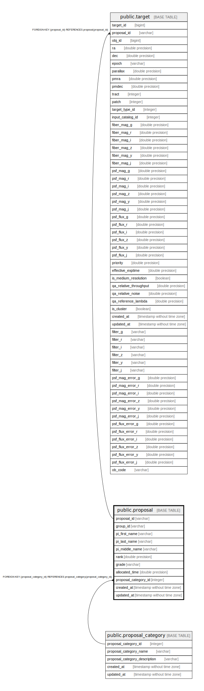

# public.proposal

## Description

## Columns

| Name | Type | Default | Nullable | Children | Parents | Comment |
| ---- | ---- | ------- | -------- | -------- | ------- | ------- |
| proposal_id | varchar |  | false | [public.target](public.target.md) |  | Unique identifier for proposal (e.g, S21B-OT06?) |
| group_id | varchar |  | true |  |  | Group ID in STARS (e.g., o21195?) |
| pi_first_name | varchar |  | true |  |  | PI's first name |
| pi_last_name | varchar |  | true |  |  | PI's last name |
| pi_middle_name | varchar |  | true |  |  | PI's middle name |
| rank | double precision |  | true |  |  | TAC score |
| grade | varchar |  | true |  |  | TAC grade (A/B/C/F in the case of HSC queue) |
| allocated_time | double precision |  | true |  |  | Total fiberhours allocated by TAC (hour) |
| proposal_category_id | integer |  | true |  | [public.proposal_category](public.proposal_category.md) |  |
| created_at | timestamp without time zone |  | true |  |  | Creation time [YYYY-MM-DDThh:mm:ss] (UTC or HST?) |
| updated_at | timestamp without time zone |  | true |  |  | Update time [YYYY-MM-DDThh:mm:ss] (UTC or HST?) |

## Constraints

| Name | Type | Definition |
| ---- | ---- | ---------- |
| proposal_proposal_category_id_fkey | FOREIGN KEY | FOREIGN KEY (proposal_category_id) REFERENCES proposal_category(proposal_category_id) |
| proposal_pkey | PRIMARY KEY | PRIMARY KEY (proposal_id) |
| proposal_proposal_id_key | UNIQUE | UNIQUE (proposal_id) |

## Indexes

| Name | Definition |
| ---- | ---------- |
| proposal_pkey | CREATE UNIQUE INDEX proposal_pkey ON public.proposal USING btree (proposal_id) |
| proposal_proposal_id_key | CREATE UNIQUE INDEX proposal_proposal_id_key ON public.proposal USING btree (proposal_id) |

## Relations

---

> Generated by [tbls](https://github.com/k1LoW/tbls)
