# public.proposal

## Description

## Columns

| Name | Type | Default | Nullable | Children | Parents | Comment |
| ---- | ---- | ------- | -------- | -------- | ------- | ------- |
| proposal_id | varchar |  | false | [public.target](public.target.md) |  | Unique identifier for proposal (e.g, S21B-OT06) |
| group_id | varchar |  | false |  |  | Group ID in STARS (e.g., o21195) |
| pi_first_name | varchar |  | true |  |  | PI's first name |
| pi_last_name | varchar |  | false |  |  | PI's last name |
| pi_middle_name | varchar |  | true |  |  | PI's middle name |
| rank | double precision |  | false |  |  | TAC score |
| grade | varchar |  | false |  |  | TAC grade (A/B/C/F and N/A) |
| allocated_time_total | double precision |  | true |  |  | Total fiberhours allocated by TAC (hour) |
| proposal_category_id | integer |  | true |  | [public.proposal_category](public.proposal_category.md) |  |
| created_at | timestamp without time zone | timezone('utc'::text, CURRENT_TIMESTAMP) | true |  |  | The date and time in UTC when the record was created |
| updated_at | timestamp without time zone |  | true |  |  | The date and time in UTC when the record was last updated |
| allocated_time_lr | double precision |  | true |  |  | Total fiberhours for the low-resolution mode allocated by TAC (hour) |
| allocated_time_mr | double precision |  | true |  |  | Total fiberhours for the medium-resolution mode allocated by TAC (hour) |
| is_too | boolean |  | true |  |  | True when the proposal is ToO |
| partner_id | integer |  | true |  | [public.partner](public.partner.md) |  |

## Constraints

| Name | Type | Definition |
| ---- | ---- | ---------- |
| proposal_proposal_category_id_fkey | FOREIGN KEY | FOREIGN KEY (proposal_category_id) REFERENCES proposal_category(proposal_category_id) |
| proposal_pkey | PRIMARY KEY | PRIMARY KEY (proposal_id) |
| proposal_partner_id_fkey | FOREIGN KEY | FOREIGN KEY (partner_id) REFERENCES partner(partner_id) |

## Indexes

| Name | Definition |
| ---- | ---------- |
| proposal_pkey | CREATE UNIQUE INDEX proposal_pkey ON public.proposal USING btree (proposal_id) |
| idx_proposal_grade | CREATE INDEX idx_proposal_grade ON public.proposal USING btree (grade) |

## Relations

```mermaid
erDiagram

"public.target" }o--o| "public.proposal" : "FOREIGN KEY (proposal_id) REFERENCES proposal(proposal_id)"
"public.proposal" }o--o| "public.proposal_category" : "FOREIGN KEY (proposal_category_id) REFERENCES proposal_category(proposal_category_id)"
"public.proposal" }o--o| "public.partner" : "FOREIGN KEY (partner_id) REFERENCES partner(partner_id)"

"public.proposal" {
  varchar proposal_id
  varchar group_id
  varchar pi_first_name
  varchar pi_last_name
  varchar pi_middle_name
  double_precision rank
  varchar grade
  double_precision allocated_time_total
  integer proposal_category_id FK
  timestamp_without_time_zone created_at
  timestamp_without_time_zone updated_at
  double_precision allocated_time_lr
  double_precision allocated_time_mr
  boolean is_too
  integer partner_id FK
}
"public.target" {
  bigint target_id
  varchar proposal_id FK
  bigint obj_id
  double_precision ra
  double_precision dec
  varchar epoch
  double_precision parallax
  double_precision pmra
  double_precision pmdec
  integer tract
  integer patch
  integer target_type_id FK
  integer input_catalog_id FK
  double_precision fiber_mag_g
  double_precision fiber_mag_r
  double_precision fiber_mag_i
  double_precision fiber_mag_z
  double_precision fiber_mag_y
  double_precision fiber_mag_j
  double_precision psf_mag_g
  double_precision psf_mag_r
  double_precision psf_mag_i
  double_precision psf_mag_z
  double_precision psf_mag_y
  double_precision psf_mag_j
  double_precision psf_flux_g
  double_precision psf_flux_r
  double_precision psf_flux_i
  double_precision psf_flux_z
  double_precision psf_flux_y
  double_precision psf_flux_j
  double_precision priority
  double_precision effective_exptime
  boolean is_medium_resolution
  double_precision qa_relative_throughput
  double_precision qa_relative_noise
  double_precision qa_reference_lambda
  boolean is_cluster
  timestamp_without_time_zone created_at
  timestamp_without_time_zone updated_at
  varchar filter_g FK
  varchar filter_r FK
  varchar filter_i FK
  varchar filter_z FK
  varchar filter_y FK
  varchar filter_j FK
  double_precision psf_mag_error_g
  double_precision psf_mag_error_r
  double_precision psf_mag_error_i
  double_precision psf_mag_error_z
  double_precision psf_mag_error_y
  double_precision psf_mag_error_j
  double_precision psf_flux_error_g
  double_precision psf_flux_error_r
  double_precision psf_flux_error_i
  double_precision psf_flux_error_z
  double_precision psf_flux_error_y
  double_precision psf_flux_error_j
  varchar ob_code
  double_precision single_exptime
  varchar qa_reference_arm FK
  double_precision total_flux_g
  double_precision total_flux_r
  double_precision total_flux_i
  double_precision total_flux_z
  double_precision total_flux_y
  double_precision total_flux_j
  double_precision total_flux_error_g
  double_precision total_flux_error_r
  double_precision total_flux_error_i
  double_precision total_flux_error_z
  double_precision total_flux_error_y
  double_precision total_flux_error_j
}
"public.proposal_category" {
  integer proposal_category_id
  varchar proposal_category_name
  varchar proposal_category_description
  timestamp_without_time_zone created_at
  timestamp_without_time_zone updated_at
}
"public.partner" {
  integer partner_id
  varchar partner_name
  varchar partner_description
  timestamp_without_time_zone created_at
  timestamp_without_time_zone updated_at
}
```

---

> Generated by [tbls](https://github.com/k1LoW/tbls)
