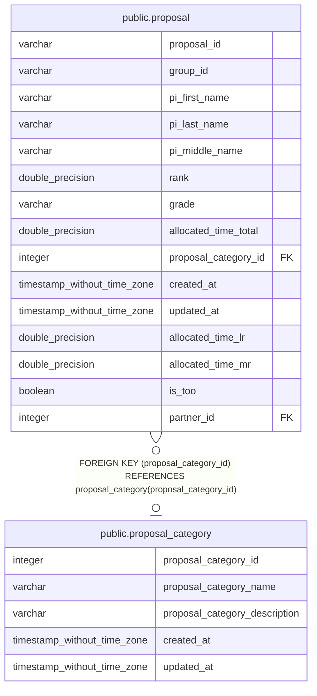

# public.proposal_category

## Description

## Columns

| Name | Type | Default | Nullable | Children | Parents | Comment |
| ---- | ---- | ------- | -------- | -------- | ------- | ------- |
| proposal_category_id | integer |  | false | [public.proposal](public.proposal.md) |  | Unique identifier of proposal category |
| proposal_category_name | varchar |  | false |  |  | Proposal category name (e.g., Openuse, Keck, Gemini, and UH) |
| proposal_category_description | varchar |  | true |  |  | Proposal category description (e.g., Openuse, Time exchange, etc. |
| created_at | timestamp without time zone | timezone('utc'::text, CURRENT_TIMESTAMP) | true |  |  | The date and time in UTC when the record was created |
| updated_at | timestamp without time zone |  | true |  |  | The date and time in UTC when the record was last updated |

## Constraints

| Name | Type | Definition |
| ---- | ---- | ---------- |
| proposal_category_pkey | PRIMARY KEY | PRIMARY KEY (proposal_category_id) |
| proposal_category_proposal_category_name_key | UNIQUE | UNIQUE (proposal_category_name) |

## Indexes

| Name | Definition |
| ---- | ---------- |
| proposal_category_pkey | CREATE UNIQUE INDEX proposal_category_pkey ON public.proposal_category USING btree (proposal_category_id) |
| proposal_category_proposal_category_name_key | CREATE UNIQUE INDEX proposal_category_proposal_category_name_key ON public.proposal_category USING btree (proposal_category_name) |

## Relations

---

> Generated by [tbls](https://github.com/k1LoW/tbls)
