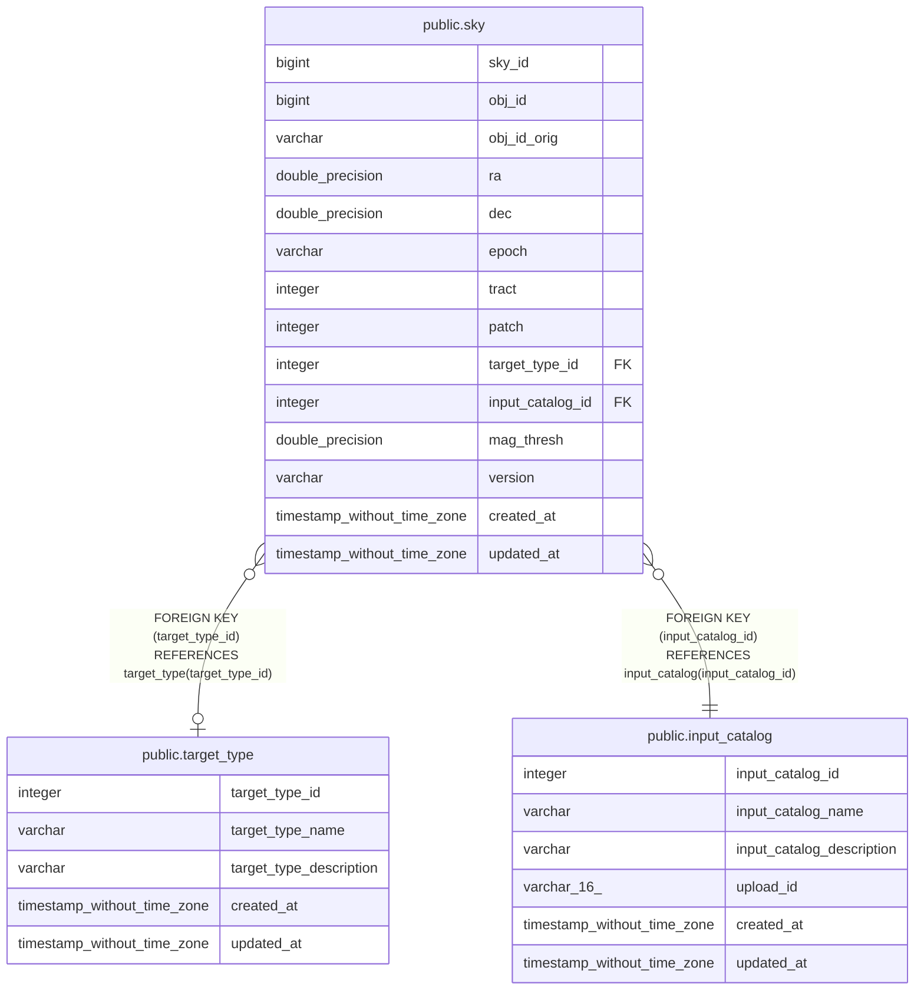

# public.sky

## Description

## Columns

| Name | Type | Default | Nullable | Children | Parents | Comment |
| ---- | ---- | ------- | -------- | -------- | ------- | ------- |
| sky_id | bigint | nextval('sky_sky_id_seq'::regclass) | false |  |  | Unique identifier for each sky position |
| obj_id | bigint |  | false |  |  | Object ID in the sky catalog |
| obj_id_orig | varchar |  | true |  |  | Original object ID in the sky catalog |
| ra | double precision |  | false |  |  | RA (ICRS, degree) |
| dec | double precision |  | false |  |  | Dec (ICRS, degree) |
| epoch | varchar |  | true |  |  | Epoch (e.g., J2000.0, J2015.5, etc.) |
| tract | integer |  | true |  |  | Tract from HSC-SSP |
| patch | integer |  | true |  |  | Patch from HSC-SSP |
| target_type_id | integer |  | true |  | [public.target_type](public.target_type.md) | target_type_id from the target_type table (must be 2 for SKY) |
| input_catalog_id | integer |  | false |  | [public.input_catalog](public.input_catalog.md) | input_catalog_id from the input_catalog table |
| mag_thresh | double precision |  | true |  |  | Sky intensity threshold in mag/arcsec^2 (only for HSC-SSP). |
| version | varchar |  | false |  |  | Version string of the sky position |
| created_at | timestamp without time zone | timezone('utc'::text, CURRENT_TIMESTAMP) | true |  |  | The date and time in UTC when the record was created |
| updated_at | timestamp without time zone |  | true |  |  | The date and time in UTC when the record was last updated |

## Constraints

| Name | Type | Definition |
| ---- | ---- | ---------- |
| sky_input_catalog_id_fkey | FOREIGN KEY | FOREIGN KEY (input_catalog_id) REFERENCES input_catalog(input_catalog_id) |
| sky_target_type_id_fkey | FOREIGN KEY | FOREIGN KEY (target_type_id) REFERENCES target_type(target_type_id) |
| sky_pkey | PRIMARY KEY | PRIMARY KEY (sky_id) |
| sky_obj_id_input_catalog_id_version_key | UNIQUE | UNIQUE (obj_id, input_catalog_id, version) |

## Indexes

| Name | Definition |
| ---- | ---------- |
| sky_pkey | CREATE UNIQUE INDEX sky_pkey ON public.sky USING btree (sky_id) |
| sky_obj_id_input_catalog_id_version_key | CREATE UNIQUE INDEX sky_obj_id_input_catalog_id_version_key ON public.sky USING btree (obj_id, input_catalog_id, version) |
| ix_sky_version | CREATE INDEX ix_sky_version ON public.sky USING btree (version) |
| sky_q3c_ang2ipix_idx | CREATE INDEX sky_q3c_ang2ipix_idx ON public.sky USING btree (q3c_ang2ipix(ra, "dec")) |
| ix_sky_input_catalog_id | CREATE INDEX ix_sky_input_catalog_id ON public.sky USING btree (input_catalog_id) |

## Relations

---

> Generated by [tbls](https://github.com/k1LoW/tbls)
