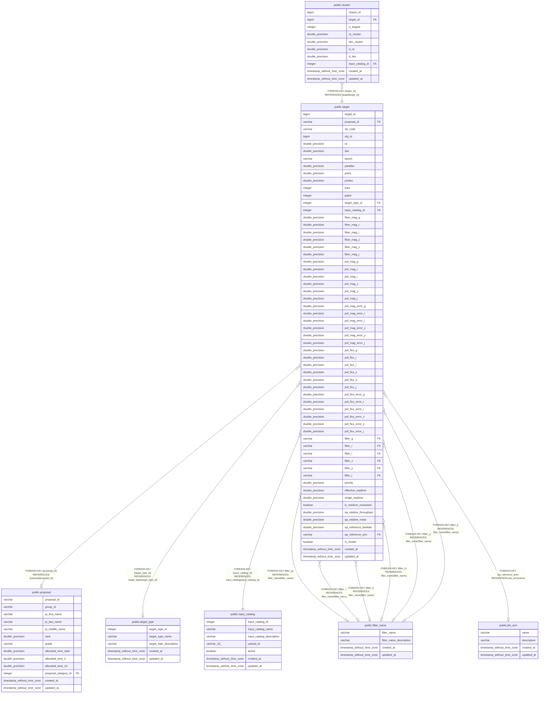

# public.target

## Description

## Columns

| Name | Type | Default | Nullable | Children | Parents | Comment |
| ---- | ---- | ------- | -------- | -------- | ------- | ------- |
| target_id | bigint | nextval('target_target_id_seq'::regclass) | false | [public.cluster](public.cluster.md) |  | Unique identifier for each target |
| proposal_id | varchar |  | true |  | [public.proposal](public.proposal.md) |  |
| ob_code | varchar |  | false |  |  | Identifer for a combination of a target, observing mode, and exposure time in a program. |
| obj_id | bigint |  | false |  |  | Object ID as specified by the observer at Phase 2 (can be same as the input_catalog_object_id) |
| ra | double precision |  | false |  |  | RA (ICRS, degree) |
| dec | double precision |  | false |  |  | Dec (ICRS, degree) |
| epoch | varchar |  | true |  |  | Epoch (default: J2000.0) |
| parallax | double precision |  | true |  |  | Parallax (mas) |
| pmra | double precision |  | true |  |  | Proper motion in right ascension direction (mas/yr) |
| pmdec | double precision |  | true |  |  | Proper motion in declination direction (mas/yr) |
| tract | integer |  | true |  |  | same definition as HSC-SSP?; can be derived from the coordinate |
| patch | integer |  | true |  |  | same definition as HSC-SSP?; can be derived from the coordinate; Note that it's defined as an integer |
| target_type_id | integer |  | true |  | [public.target_type](public.target_type.md) | target type ID (default: 1 = SCIENCE) |
| input_catalog_id | integer |  | false |  | [public.input_catalog](public.input_catalog.md) | Input catalog ID from the input_catalog table |
| fiber_mag_g | double precision |  | true |  |  | g-band magnitude within a fiber (AB mag) |
| fiber_mag_r | double precision |  | true |  |  | r-band magnitude within a fiber (AB mag) |
| fiber_mag_i | double precision |  | true |  |  | i-band magnitude within a fiber (AB mag) |
| fiber_mag_z | double precision |  | true |  |  | z-band magnitude within a fiber (AB mag) |
| fiber_mag_y | double precision |  | true |  |  | y-band magnitude within a fiber (AB mag) |
| fiber_mag_j | double precision |  | true |  |  | J band magnitude within a fiber (AB mag) |
| psf_mag_g | double precision |  | true |  |  | g-band PSF magnitude (AB mag) |
| psf_mag_r | double precision |  | true |  |  | r-band PSF magnitude (AB mag) |
| psf_mag_i | double precision |  | true |  |  | i-band PSF magnitude (AB mag) |
| psf_mag_z | double precision |  | true |  |  | z-band PSF magnitude (AB mag) |
| psf_mag_y | double precision |  | true |  |  | y-band PSF magnitude (AB mag) |
| psf_mag_j | double precision |  | true |  |  | J band PSF magnitude (AB mag) |
| psf_mag_error_g | double precision |  | true |  |  | Error in g-band PSF magnitude (AB mag) |
| psf_mag_error_r | double precision |  | true |  |  | Error in r-band PSF magnitude (AB mag) |
| psf_mag_error_i | double precision |  | true |  |  | Error in i-band PSF magnitude (AB mag) |
| psf_mag_error_z | double precision |  | true |  |  | Error in z-band PSF magnitude (AB mag) |
| psf_mag_error_y | double precision |  | true |  |  | Error in y-band PSF magnitude (AB mag) |
| psf_mag_error_j | double precision |  | true |  |  | Error in J band PSF magnitude (AB mag) |
| psf_flux_g | double precision |  | true |  |  | g-band PSF flux (nJy) |
| psf_flux_r | double precision |  | true |  |  | r-band PSF flux (nJy) |
| psf_flux_i | double precision |  | true |  |  | i-band PSF flux (nJy) |
| psf_flux_z | double precision |  | true |  |  | z-band PSF flux (nJy) |
| psf_flux_y | double precision |  | true |  |  | y-band PSF flux (nJy) |
| psf_flux_j | double precision |  | true |  |  | J band PSF flux (nJy) |
| psf_flux_error_g | double precision |  | true |  |  | Error in g-band PSF flux (nJy) |
| psf_flux_error_r | double precision |  | true |  |  | Error in r-band PSF flux (nJy) |
| psf_flux_error_i | double precision |  | true |  |  | Error in i-band PSF flux (nJy) |
| psf_flux_error_z | double precision |  | true |  |  | Error in z-band PSF flux (nJy) |
| psf_flux_error_y | double precision |  | true |  |  | Error in y-band PSF flux (nJy) |
| psf_flux_error_j | double precision |  | true |  |  | Error in J band PSF flux (nJy) |
| filter_g | varchar |  | true |  | [public.filter_name](public.filter_name.md) | g-band filter (g_hsc, g_ps1, g_sdss, etc.) |
| filter_r | varchar |  | true |  | [public.filter_name](public.filter_name.md) | r-band filter (r_hsc, r_ps1, r_sdss, etc.) |
| filter_i | varchar |  | true |  | [public.filter_name](public.filter_name.md) | i-band filter (i_hsc, i_ps1, i_sdss, etc.) |
| filter_z | varchar |  | true |  | [public.filter_name](public.filter_name.md) | z-band filter (z_hsc, z_ps1, z_sdss, etc.) |
| filter_y | varchar |  | true |  | [public.filter_name](public.filter_name.md) | y-band filter (y_hsc, y_ps1, y_sdss, etc.) |
| filter_j | varchar |  | true |  | [public.filter_name](public.filter_name.md) | j-band filter (j_mko, etc.) |
| priority | double precision |  | true |  |  | Priority of the target specified by the observer within the proposal |
| effective_exptime | double precision |  | false |  |  | Requested effective exposure time (s) |
| single_exptime | double precision |  | false |  |  | Individual exposure time (s) |
| is_medium_resolution | boolean |  | true |  |  | True if the medium resolution mode is requested |
| qa_relative_throughput | double precision |  | true |  |  | Relative throughput to the reference value requested by the observer (default: 1.0) |
| qa_relative_noise | double precision |  | true |  |  | Relative noise to the reference value requested by the observer (default: 1.0) |
| qa_reference_lambda | double precision |  | true |  |  | Reference wavelength to evaluate effective exposure time (angstrom or nm?) |
| qa_reference_arm | varchar |  | true |  | [public.pfs_arm](public.pfs_arm.md) | Reference arm to evaluate effective exposure time ['b'|'r'|'n'|'m'] |
| is_cluster | boolean |  | true |  |  | True if it is a cluster of multiple targets. |
| created_at | timestamp without time zone | timezone('utc'::text, CURRENT_TIMESTAMP) | true |  |  | The date and time in UTC when the record was created |
| updated_at | timestamp without time zone |  | true |  |  | The date and time in UTC when the record was last updated |

## Constraints

| Name | Type | Definition |
| ---- | ---- | ---------- |
| target_filter_g_fkey | FOREIGN KEY | FOREIGN KEY (filter_g) REFERENCES filter_name(filter_name) |
| target_filter_i_fkey | FOREIGN KEY | FOREIGN KEY (filter_i) REFERENCES filter_name(filter_name) |
| target_filter_j_fkey | FOREIGN KEY | FOREIGN KEY (filter_j) REFERENCES filter_name(filter_name) |
| target_filter_r_fkey | FOREIGN KEY | FOREIGN KEY (filter_r) REFERENCES filter_name(filter_name) |
| target_filter_y_fkey | FOREIGN KEY | FOREIGN KEY (filter_y) REFERENCES filter_name(filter_name) |
| target_filter_z_fkey | FOREIGN KEY | FOREIGN KEY (filter_z) REFERENCES filter_name(filter_name) |
| target_qa_reference_arm_fkey | FOREIGN KEY | FOREIGN KEY (qa_reference_arm) REFERENCES pfs_arm(name) |
| target_input_catalog_id_fkey | FOREIGN KEY | FOREIGN KEY (input_catalog_id) REFERENCES input_catalog(input_catalog_id) |
| target_target_type_id_fkey | FOREIGN KEY | FOREIGN KEY (target_type_id) REFERENCES target_type(target_type_id) |
| target_proposal_id_fkey | FOREIGN KEY | FOREIGN KEY (proposal_id) REFERENCES proposal(proposal_id) |
| target_pkey | PRIMARY KEY | PRIMARY KEY (target_id) |
| target_propid_obcode_catid_objid_resolution_key | UNIQUE | UNIQUE (proposal_id, ob_code, input_catalog_id, obj_id, is_medium_resolution) |
| target_propid_obcode_key | UNIQUE | UNIQUE (proposal_id, ob_code) |

## Indexes

| Name | Definition |
| ---- | ---------- |
| target_pkey | CREATE UNIQUE INDEX target_pkey ON public.target USING btree (target_id) |
| target_propid_obcode_catid_objid_resolution_key | CREATE UNIQUE INDEX target_propid_obcode_catid_objid_resolution_key ON public.target USING btree (proposal_id, ob_code, input_catalog_id, obj_id, is_medium_resolution) |
| target_propid_obcode_key | CREATE UNIQUE INDEX target_propid_obcode_key ON public.target USING btree (proposal_id, ob_code) |
| target_q3c_ang2ipix_idx | CREATE INDEX target_q3c_ang2ipix_idx ON public.target USING btree (q3c_ang2ipix(ra, "dec")) |

## Relations

---

> Generated by [tbls](https://github.com/k1LoW/tbls)
