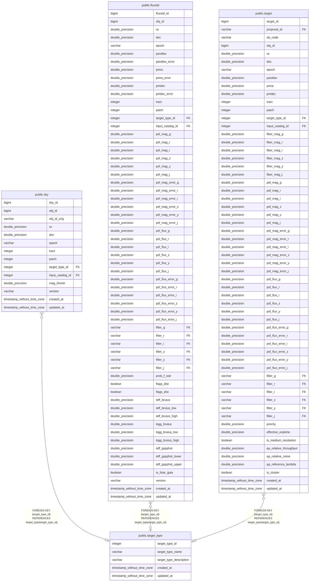

# public.target_type

## Description

## Columns

| Name | Type | Default | Nullable | Children | Parents | Comment |
| ---- | ---- | ------- | -------- | -------- | ------- | ------- |
| target_type_id | integer |  | false | [public.sky](public.sky.md) [public.fluxstd](public.fluxstd.md) [public.target](public.target.md) |  | Unique identifier for target types |
| target_type_name | varchar |  | false |  |  | Name for the target type. |
| target_type_description | varchar |  | true |  |  | Description of the target type |
| created_at | timestamp without time zone |  | true |  |  | The date and time in UTC when the record was created |
| updated_at | timestamp without time zone |  | true |  |  | The date and time in UTC when the record was last updated |

## Constraints

| Name | Type | Definition |
| ---- | ---- | ---------- |
| target_type_pkey | PRIMARY KEY | PRIMARY KEY (target_type_id) |

## Indexes

| Name | Definition |
| ---- | ---------- |
| target_type_pkey | CREATE UNIQUE INDEX target_type_pkey ON public.target_type USING btree (target_type_id) |

## Relations

---

> Generated by [tbls](https://github.com/k1LoW/tbls)
