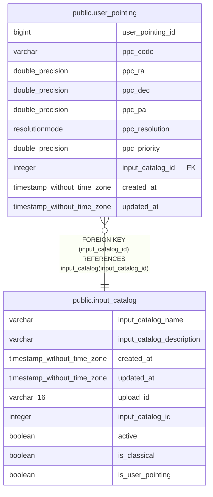

# public.user_pointing

## Description

## Columns

| Name | Type | Default | Nullable | Children | Parents | Comment |
| ---- | ---- | ------- | -------- | -------- | ------- | ------- |
| user_pointing_id | bigint | nextval('user_pointing_user_pointing_id_seq'::regclass) | false |  |  | Unique identifier for each user-defined pointing (autoincremented primary key) |
| ppc_code | varchar |  | false |  |  | String identifier of the pointing set either by the uploader or user |
| ppc_ra | double precision |  | false |  |  | RA of the pointing center (ICRS, degree) |
| ppc_dec | double precision |  | false |  |  | Dec of the pointing center (ICRS, degree) |
| ppc_pa | double precision |  | false |  |  | Position angle of the pointing center (degree) |
| ppc_resolution | resolutionmode |  | false |  |  | Resolution mode of the pointing ('L' or 'M') |
| ppc_priority | double precision |  | false |  |  | Priority of the pointing calculated by the uploader |
| input_catalog_id | integer |  | false |  | [public.input_catalog](public.input_catalog.md) | Input catalog ID from the input_catalog table |
| created_at | timestamp without time zone | timezone('utc'::text, CURRENT_TIMESTAMP) | true |  |  | The date and time in UTC when the record was created |
| updated_at | timestamp without time zone |  | true |  |  | The date and time in UTC when the record was last updated |

## Constraints

| Name | Type | Definition |
| ---- | ---- | ---------- |
| user_pointing_input_catalog_id_fkey | FOREIGN KEY | FOREIGN KEY (input_catalog_id) REFERENCES input_catalog(input_catalog_id) |
| user_pointing_pkey | PRIMARY KEY | PRIMARY KEY (user_pointing_id) |

## Indexes

| Name | Definition |
| ---- | ---------- |
| user_pointing_pkey | CREATE UNIQUE INDEX user_pointing_pkey ON public.user_pointing USING btree (user_pointing_id) |

## Relations

---

> Generated by [tbls](https://github.com/k1LoW/tbls)
